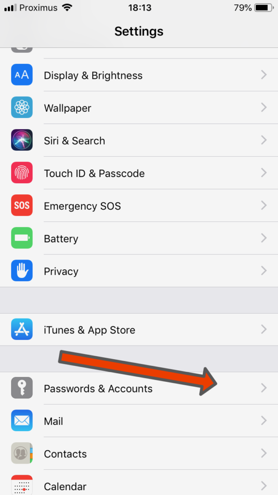
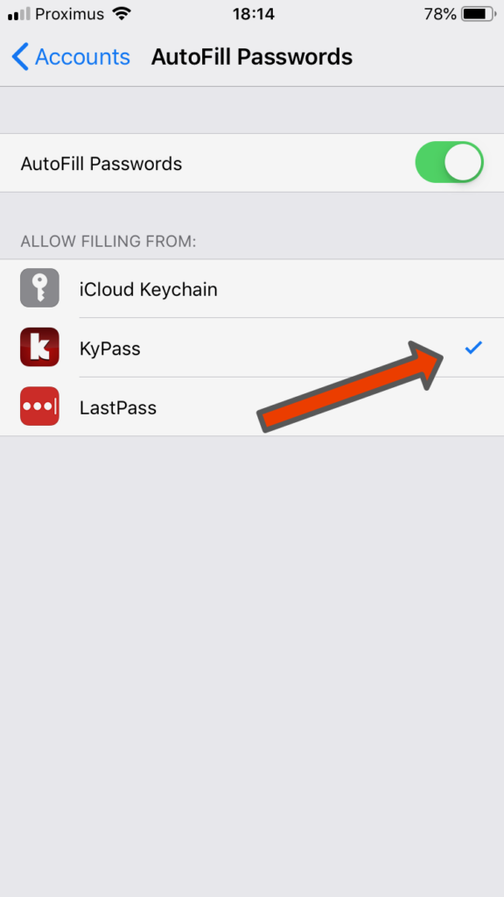

# Autofill extension

How to use the autofill extension ?

Just follow these steps: 

Once it's done, a Passwords button will appear in all your applications that supports passwords. Click on it to select a password from KyPass

