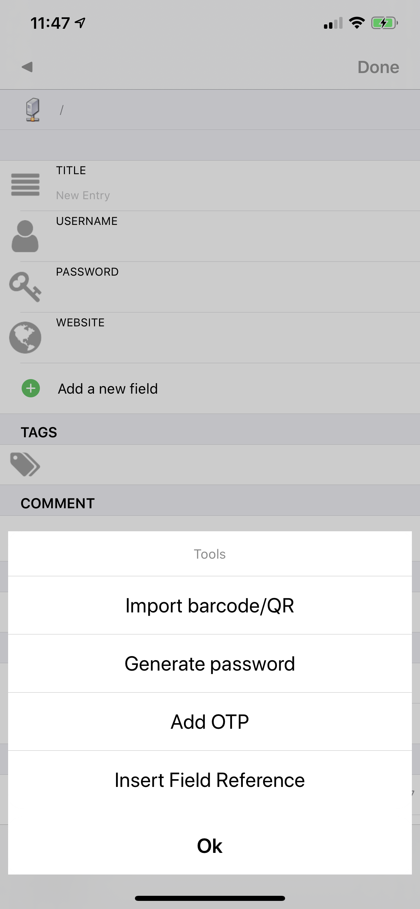

# OTP

Just enter the **OTP** url in any field and KyPass will translate it to the correct secret key:

```text
otpauth://totp/Example:alice@google.com?secret=DPJBSKY3EHWP3PXP&issuer=Example 
```

KyPass could also capture this **OTP** url from a QRCode \("Add OTP" function from the tools menu\)



More informations on the OTP url are available on the [Google Authenticator](https://github.com/google/google-authenticator/wiki/Key-Uri-Format) webpage.

