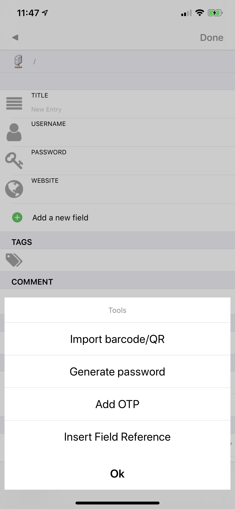

# OTP

Just enter the **OTP** url in any field and KyPass will translate it to the correct secret key:

```text
otpauth://totp/Example:alice@google.com?secret=DPJBSKY3EHWP3PXP&issuer=Example 
```

KyPass could also capture this **OTP** url from a QRCode \("Add OTP" function from the tools menu\)




## OTP arguments

These arguments are used by KyPass to generate the **OTP** code:

### secret

This parameter is an arbitrary key value encoded in Base32 according to [RFC 3548](http://tools.ietf.org/html/rfc3548).

### digits

This parameter may have the values 6 or 8, and determines how long of a one-time passcode to display to the user. 

If omitted, the default value is **6**.

### period 

This parameter defines a period that a **OTP** code will be valid for, in seconds. 

If omitted, the default value is **30**.

